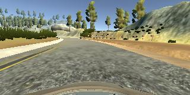
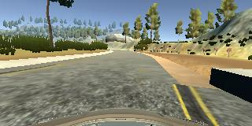
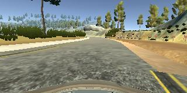
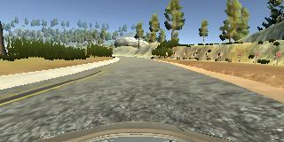
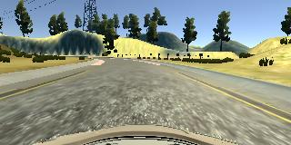
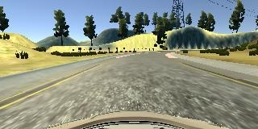

**Behavioral Cloning**
---

**Behavioral Cloning Project**

The goals of this project are the following:

* Use the simulator to collect data of good driving behavior
* Build, a convolution neural network in Keras that predicts steering angles from images
* Train and validate the model with a training and validation set
* Test that the model successfully drives around track one without leaving the road
* Summarize the results with a written report


## Rubric Points
### Here I will consider the [rubric points](https://review.udacity.com/#!/rubrics/432/view) individually and describe how I addressed each point in my implementation.

---
### Files Submitted & Code Quality

#### 1. Submission includes all required files and can be used to run the simulator in autonomous mode

My project includes the following files:
* `model.py` containing the script to create and train the model
* `drive.py` for driving the car in autonomous mode
* `my_model.h5` containing a trained convolution neural network
* `writeup_report.md`  summarizing the results
* `run1.mp4` - A video recording of my vehicle driving autonomously at least one lap around the track.

#### 2. Submission includes functional code
Using the Udacity provided simulator and my `drive.py` file, the car can be driven autonomously around the track by executing
```sh
python drive.py my_model.h5
```

#### 3. Submission code is usable and readable

The `model.py` file contains the code for training and saving the convolution neural network. The file shows the pipeline I used for training and validating the model, and it contains comments to explain how the code works.

### Model Architecture and Training Strategy

#### 1. An appropriate model architecture has been employed

I used NVIDIA Architecture.
My model consists of a convolution neural network with 3x3 nad 5x5 filter sizes and depths between 24 and 64 (`model.py` lines 124-141)

The model includes RELU layers to introduce nonlinearity , and the data is normalized in the model using a Keras lambda layer (code line 128).

#### 2. Attempts to reduce overfitting in the model
The model contains dropout layer in order to reduce overfitting (`model.py` lines 138).

I augment the original data to ensure that the model was not overfitting (code line 48-69). The model was tested by running it through the simulator and ensuring that the vehicle could stay on the track.

#### 3. Model parameter tuning

The model used an adam optimizer, so the learning rate was not tuned manually (`model.py` line 144).

#### 4. Appropriate training data

Training data was chosen to keep the vehicle driving on the road. I used a combination of center lane driving, recovering from the left and right sides of the road, driving in the counter direction ,data from the other 2 cameras (left\&right) and augmented data from flipping the original data.

For details about how I created the training data, see the next section.

### Model Architecture and Training Strategy

#### 1. Solution Design Approach

The overall strategy for deriving a model architecture was to generate a good data and use it on the the NVIDIA Architecture.

My first step was to use a convolution neural network model similar to NVIDIA Architecture, I thought this model might be appropriate because it was used before and got good results

In order to gauge how well the model was working, I split my image and steering angle data into a training and validation set. the mean square error was low for training and validation set.

To combat the overfitting, I added a dropout layer and augment the original data by flipping it.


At the end of the process, the vehicle is able to drive autonomously around the track without leaving the road.

#### 2. Final Model Architecture

The final model architecture (`model.py` lines 124-141) consisted of a convolution neural network with the following layers and layer sizes :


| Layer         		|     Description	        					|
|:---------------------:|:---------------------------------------------:|
| Input         		| 160x320x3 RGB image   							|
| Cropping2D    	| outputs 65x320x3 	|
| Lambda					|		  outputs 65x320x3										|
| Convolution 5x5     	| 2x2 stride, valid padding, outputs 31x158x24 	|
| RELU					|		  outputs 31x158x24										|
| Convolution 5x5     	| 2x2 stride, valid padding, outputs 14x77x36 	|
| RELU					|		  outputs 14x77x36										|
| Convolution 5x5     	| 2x2 stride, valid padding, outputs 5x37x48 	|
| RELU					|	  outputs 5x37x48											|
| Convolution 3x3     	| 1x1 stride, valid padding, outputs 3x35x64 	|
| RELU					|			outputs 3x35x64	|
| Convolution 3x3     	| 1x1 stride, valid padding, outputs 1x33x64 	|
| RELU					|		  outputs 1x33x64										|
| Flatten	      	|   outputs 2112 				|
| Fully connected		| outputs 100        									|
| Dropout		|keeprate 0.75, outputs 100        									|
| Fully connected		| outputs 50        									|
| Fully connected		| outputs 10        									|
| Fully connected		| outputs 1        									|


#### 3. Creation of the Training Set & Training Process

To capture good driving behavior, I first recorded four laps on track one using center lane driving. Here is an example image of center lane driving:



I then recorded  2 laps the vehicle driving in the counter direction.
Here is an example image of center lane driving:


I then recorded the vehicle recovering from the left side and right sides of the road back to center so that the vehicle would learn to keep itself in the center These images show what a recovery looks like starting from right:

<br><br>
<br><br>


I also used the captured images from right and left cameras with correction constant.

To augment the data sat, I also flipped images and angles thinking that this would increase the dataset and reduce the overfitting  For example, here is an image that has then been flipped:

<br><br>
<br><br>


After the collection process, I had 14522 number of data points. I then preprocessed this data by Converting it to YUV space

Then, I normalized the image data to make its mean =0 and its standard deviation=1.

I finally randomly shuffled the data set and put 2% of the data into a validation set.

I used this training data for training the model. The validation set helped determine if the model was over or under fitting. The ideal number of epochs was 5 evidenced by observing and tuning.
I used an adam optimizer so that manually training the learning rate wasn't necessary.
